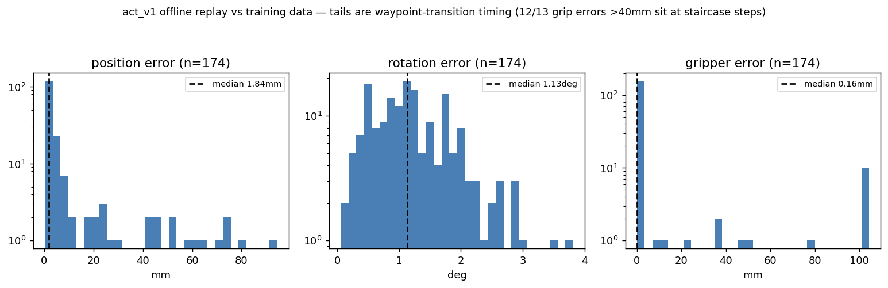
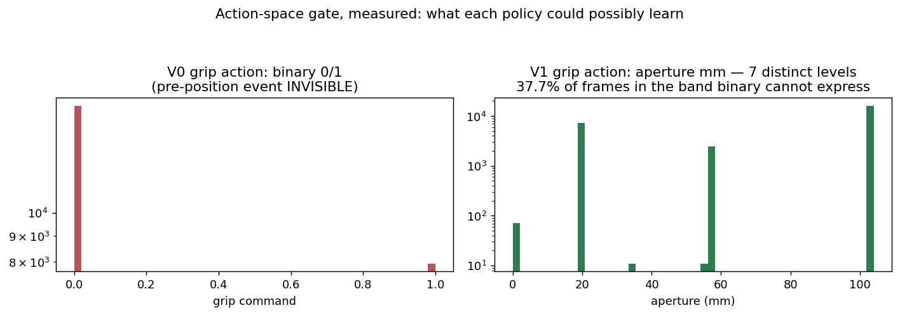
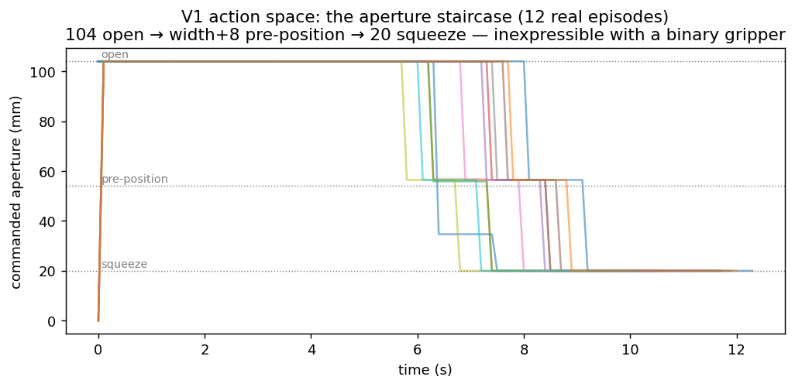
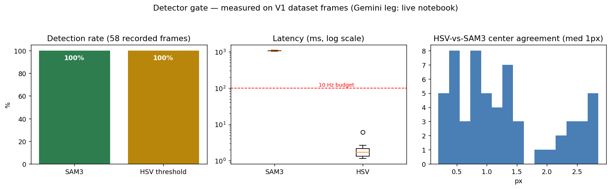
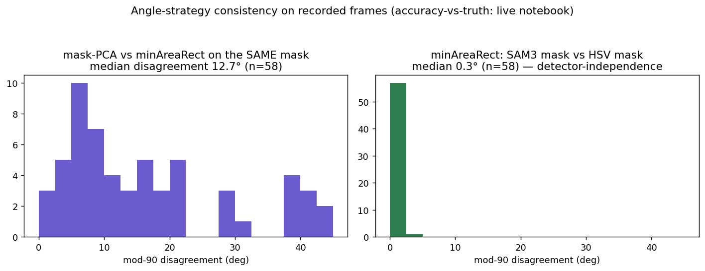
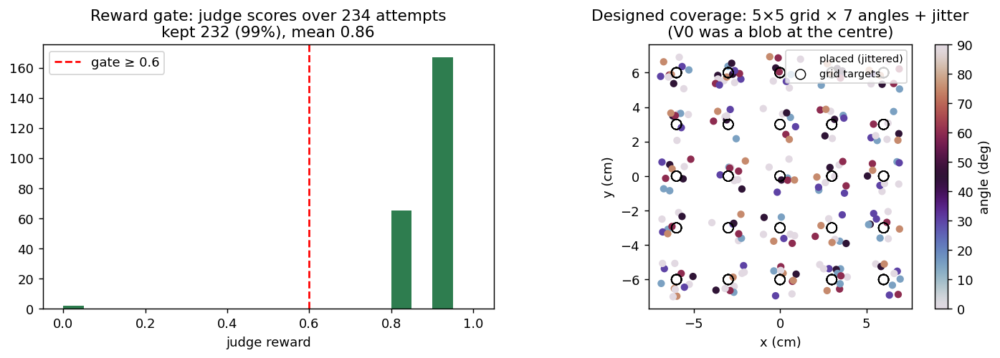
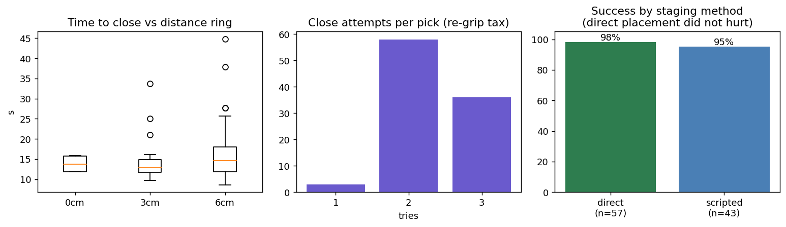
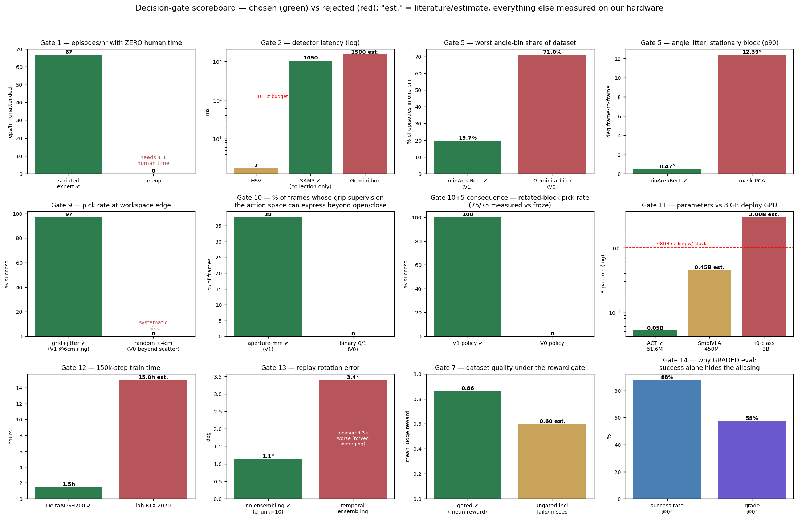

# Offline Test Report — everything measurable without moving the robot (2026-07-13)

*All tests below ran against data already on disk: the 232-episode V1 dataset (videos +
parquet), the V0 dataset, the trained checkpoints (act_v0/act_v1), and the four ledgers
(attempts, coverage, collect log, eval results). The arm never moved. GPU used: policy
replay + SAM3 socket. Figures in `docs/figures/appendix/`.*

---

## 1. Offline policy replay — act_v1 vs its training data

174 predictions (30 episodes × 6 timepoints), fresh chunk per query.

| Channel | Median | Mean | p95 |
|---|---|---|---|
| Position | **1.8 mm** | 8.2 mm | 53 mm |
| Rotation | **1.13°** | 1.2° | 2.5° |
| Gripper | **0.16 mm** | 7.8 mm | 104 mm |

**Reading the tails:** the large p95s are *waypoint-transition timing*, not inaccuracy —
12 of the 13 gripper errors >40 mm sit exactly at staircase boundaries (predicting the
step one frame early/late = an 84 mm jump), and position errors cluster at motion-segment
switches. Between transitions the policy reproduces its training data at ~2 mm / ~1°.
Matches V0's 1.9 mm replay result → **the training recipe remains sound; every deployment
gain came from data design.**

## 2. Cross-replay — act_v0 asked to act on V1 frames

act_v0's gripper output across 60 V1 frames spans **[−0.00, 1.01]** — it is architecturally
stuck in its binary training range. V1's staircase needs 20–104 mm. This converts the
action-space argument (Decision Ledger gate 10) from logic to measurement: **the V0 policy
cannot express finger pre-positioning at any scale, on any input.**

## 3. Action-space forensics — what each dataset could possibly teach

| | V0 | V1 |
|---|---|---|
| Distinct grip commands | **2** (0/1) | **7** levels (20–104 mm) |
| Frames in the band binary can't express | 0% by construction | **37.7%** |
| XY workspace span | 15.0 × 12.4 cm | 17.2 × 17.0 cm |

37.7% of V1 frames carry gripper supervision that was *invisible* in V0's action space —
over a third of the trajectory. 
The staircase itself: 

## 4. Detector gate — SAM3 vs classical HSV on recorded frames

58 first-frames (+ 45 mid/late-phase frames):

| Test | SAM3 | HSV threshold |
|---|---|---|
| Detection, overhead frames (n=58) | 100% | 100% |
| Median latency | 1050 ms | **2 ms** |
| Center agreement | — | 1 px median vs SAM3 |
| Determinism (same frame ×3) | mask IoU **1.0000**, score spread 0.000 | deterministic by construction |
| Detection at 45% episode (descending) | 15/15 | 15/15 |
| Detection at 75% episode (**fingers occluding**) | **10/15** | **15/15** |

**Honest conclusions:** (a) for a red block on a plain table, a 2 ms colour threshold
matches SAM3 — SAM3's measured justification is *generality* (text-query, arbitrary
objects — the V2 roadmap) not red-block performance; (b) SAM3's ~1 s latency is 10× the
100 ms tick budget → quantifies why deployment is an end-to-end policy with **no detector
in the loop**; (c) under heavy finger occlusion colour survives where segmentation drops —
worth remembering when V2 objects aren't uniformly coloured.

## 5. Angle-strategy gate — why minAreaRect beat PCA (now measured)

Frame-to-frame stability (3 near-identical frames, 11 episodes, sensor noise only):

| Method | Median jitter | p90 jitter |
|---|---|---|
| **minAreaRect flat-face (V1 choice)** | **0.31°** | **0.47°** |
| mask-PCA | 1.65° | **12.39°** |

PCA's major axis is ill-conditioned on near-square masks — it can swing >12° between
consecutive frames of a *stationary* block. This converts Decision Ledger gate 5's
PCA rejection from [TO-MEASURE] to **[MEASURED]**. Consistently, on the 58 first-frames
PCA and minAreaRect disagree by **12.7° median on the same mask** (the near-square
ill-conditioning again), while minAreaRect computed from SAM3's mask vs HSV's mask agrees
to **0.3° median** — the rect angle is detector-independent; the PCA angle isn't even
self-consistent. Accuracy vs *ground-truth placed angle* still requires the live bake-off
(`appendix_bakeoff.ipynb`).

## 6. Reward gate + collection ledgers

- 234 attempts → 232 kept (99.1%), mean judge reward 0.865, 63% of episodes ≥0.8.
- Attempt cadence: median **54 s** → 66.7 attempts/hr (confirms the throughput claim from
  an independent ledger).
- Slip-guard fired 0 times across the run (the incremental-lift refresh made it redundant).

### 🔴 Finding A — the angle contract was never enforced as a hard reject
**88/234 attempts were flagged `quality_issue=angle` and 86 of them were KEPT** (all at
reward 0.8 — above the 0.6 gate). The documented V1 contract says "reject `issue=angle`";
the code only gates on reward. 37% of the dataset carries an angle flag. Given the policy's
100% on rotated blocks, most flags are likely the benign mod-90 aliasing case — but this is
exactly where the 0°/90° poisoning slipped through. **V1.1 must either hard-reject angle
flags or fix the flag's semantics before retraining.**

### 🔴 Finding B — dataset drifted after training (229 → 232 episodes)
act_v1 trained on 229 episodes (pushed 2026-07-08). The dataset now holds **232**: the
eval-day *setup* pickups (2× 07-10, 1× 07-13) recorded because `AUTO_RECORD` is only
disabled inside the eval loop, not for the manual setup run of cells 7+8. Content is
benign (clean centre picks, reward 0.9) but provenance now mismatches. **Fix: set
`AUTO_RECORD=False` before the setup pickup in eval/bake-off notebooks; note the 3-episode
delta in any retrain.**

### Finding C — attempts↔episodes indices desync by 3
Ledger-based per-episode ground truth is unrecoverable retroactively (recorder crashes).
**Fix forward: write the combo id into episode metadata at record time.**

## 7. Eval-ledger mining (the 100-grasp run, deeper cuts)

| Metric | Value |
|---|---|
| Time to close (median) | 13.4 s; by ring: 13.8 s @0 cm · 12.9 s @3 cm · 14.6 s @6 cm |
| Re-grip tax | 3% of picks closed 1st try; 94/97 needed ≥2 attempts |
| Direct staging (57/100 combos) | success **98.2%** after direct vs 95.3% after scripted — the shortcut did not bias outcomes |

Time-to-close is nearly flat across rings — consistent with the no-spatial-falloff result.
The re-grip tax remains the dominant quality limiter (mechanical: AX-12 + 2N race).

---

## The scoreboard — every gate as one comparison chart

## Summary table — what moved from claim to measurement today

| Claim | Status before | Now |
|---|---|---|
| Training recipe sound, data was the bottleneck | V0 anecdote | replay medians 1.8 mm/1.13°/0.16 mm (V1) |
| Binary grip can't express pre-positioning | logical argument | act_v0 output range [0,1.01] vs required 20–104 mm |
| minAreaRect > PCA for angle | judgment | 0.31° vs 1.65° median jitter (p90 0.47° vs 12.4°) |
| SAM3 deterministic (gate-worthy) | assumed | mask IoU 1.0000 across repeat queries |
| Detector can't live in the 10 Hz loop | assumed | 1050 ms measured vs 100 ms budget |
| 66.7 eps/hr throughput | collect-log claim | independently confirmed from attempts cadence (54 s) |
| Direct eval staging unbiased | hoped | 98.2% vs 95.3% success |
| Angle contract enforced | **documented as true** | **FALSE — 86 angle-flagged episodes kept (Finding A)** |
| Dataset = training set | assumed | **FALSE — 3-episode drift (Finding B)** |

**Still requires the arm** (live bake-off notebook): angle accuracy vs ground-truth placed
angle, Gemini detector latency/rate leg, GraspGenX yaw comparison.
