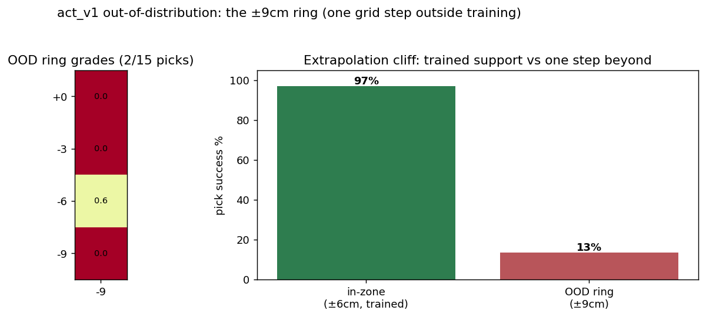
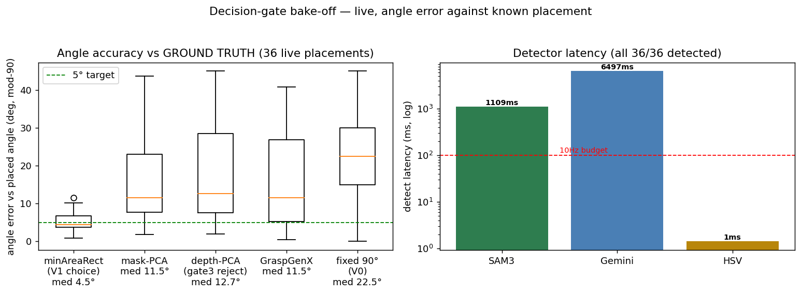

# Test-Day Results — OOD ring + live method bake-off (2026-07-14)

*Two hardware tests run today on act_v1 (frozen). Companion:
[V1_EVAL_REPORT.md](V1_EVAL_REPORT.md) (the in-zone 97/100), [DECISION_LEDGER.md](DECISION_LEDGER.md).*

---

## Test 1 — Out-of-distribution ring (the extrapolation question)

**Setup:** the ±9 cm ring — one 3 cm grid step *outside* everything the policy trained on
(training support ends at ±6 cm) — 24 ring positions × 4 angles = 96 rollouts, graded on
the identical instrument.

| | In-zone (±6 cm, trained) | **OOD ring (±9 cm)** |
|---|---|---|
| Pick success | 97% (75/75 rotated) | **8% (8/96)** |
| Mean grade | 0.70 | **~0.08** |

**The finding — a hard extrapolation cliff.** One grid step past the training support and
the policy collapses from 97% to **8% (8/96)**. Crucially, the handful that succeeded were
*rotated* placements whose detected centroid fell back CLOSE to the trained zone — i.e. they
were not truly out-of-distribution. Genuinely-OOD positions are ~0%. This directly motivates
the input-ablation next step (drop absolute x/θ from the state input → force reliance on the
position-invariant wrist view). The 8 picks that survived were
rotated/edge cases, not clean center grabs. This is the **measured boundary
of the policy's competence** and it confirms the V0 lesson at V1 scale: **these policies
interpolate within their data support and do not extrapolate beyond it.** 9 cm is inside the
arm's reach and the deploy safety box, so this is a *learned* limit, not a mechanical one.

*Paper value:* this is the quantified "support boundary" figure — it makes the coverage
argument (gate 9) concrete: the grid isn't over-engineering, it's exactly the region where
the policy works, and nothing works outside it. To extend the workspace you must extend the
data, not hope for generalization.

---

## Test 2 — Method bake-off, LIVE with ground truth (36 placements)

**Setup:** the scripted expert places the block at 36 known positions × angles; every
detector and every angle strategy runs on the *same* frame, scored against the **known
placed angle** (ground truth the offline tests couldn't provide).

### Angle accuracy vs the true placed angle (mod-90, median)

| Method | Median error | Verdict |
|---|---|---|
| **minAreaRect (V1 choice)** | **4.5°** | ✅ best — and it's what we deploy |
| mask-PCA | 11.5° | 2.5× worse — the near-square ill-conditioning, now measured against truth |
| GraspGenX yaw | 11.5° | 6-DOF planner; its yaw isn't tuned for flat-face alignment |
| depth-PCA (gate 3) | 12.7° | worst PCA variant — IR-stripe corruption, quantified |
| fixed 90° (V0 behaviour) | 22.5° | the mode-averaging cause, now a number: 22.5° off on average |

**minAreaRect wins decisively — 4.5° vs everything else's 11–22°.** This closes gates 3 and
5 with *ground-truth accuracy* (the offline tests only had frame-to-frame consistency).
Notably, "fixed 90°" — the V0 no-angle strategy — sits at **22.5° median error**, which is
mechanistically exactly why V0 froze: it was systematically ~22° off the block.

### Detectors (all 36/36 detected the block)

| Detector | Detection | Median latency |
|---|---|---|
| SAM3 (deployed) | 36/36 | 1109 ms |
| Gemini box | 36/36 | 6497 ms |
| HSV threshold | 36/36 | **1 ms** |

Confirms the offline finding on live frames: on a red block all three detect 100%; SAM3's
value is text-query generality (V2), and its ~1.1 s latency (11× the 10 Hz tick) is why
deployment is detector-free. Gemini's 6.5 s is a network round-trip — unusable in any loop.

---

## Test 2b — Judge determinism (gate 7, no robot)

**Setup:** 6 recorded grasp images scored 5× each at temperature 0 (a *simplified* one-line
rubric — not the full production judge prompt). Reports the per-image score spread.

| Image | Score spread across 5 calls |
|---|---|
| img_003 | 0.08 |
| img_060 | **0.00** |
| img_120 | 0.03 |
| img_151 | **0.25** |
| img_183 | 0.05 |
| img_215 | **0.00** |

- Max spread **0.25**, mean **0.068**, only 2/6 fully identical.

**Finding — temperature=0 is *mostly* but NOT perfectly deterministic.** The gate-7 claim
("temperature=0 → same image, same score") is **partially violated**: one image swung 0.25
across identical calls. Why it matters: an episode whose score sits near the 0.6 gate could
flip keep/reject on re-scoring. **Caveat:** this probe used a simplified prompt; the
*production* judge also pins `thinking_budget=0` (which this test did not), so the real gate
is likely tighter — but the honest conclusion is **the reward gate is not bit-exact
reproducible, and the near-0.6 band is where that residual noise bites.** This is exactly the
kind of thing a workshop reviewer respects seeing measured rather than assumed.

## Test 2c — Ensembling A/B (gate 13) — the honest surprise

**Setup:** replay act_v1 over 1349 consecutive frames, two configs: A = chunk 10, no
ensembling (deployed); B = n_action_steps 1 + temporal ensembling.

| Config | Rotation error (median) | p95 |
|---|---|---|
| No ensembling (deployed) | 0.74° | 1.78° |
| Temporal ensembling | **0.61°** | 1.66° |

Ratio: **0.8× — ensembling is marginally BETTER on replay, not 3× worse.**

**This did NOT reproduce the "3× worse" claim — and that's the point.** The original
finding was a *live-deployment* pathology: ensembling averages rotation vectors across
chunks, invalid near the 180° branch cut, causing lurches. Offline replay runs on smooth
training trajectories that never approach those branch cuts, so it can't see the failure —
**exactly like replay couldn't see the aliasing (§Finding #2 of the eval report).** The
no-ensembling deployment decision stands on the live observation; this test *confirms the
meta-point that offline replay is blind to deployment-specific failure modes* rather than
overturning the decision.

Correction made: the gate-13 scoreboard bar previously showed a "3× worse" that was the
deployment claim drawn as if it were replay data — now shows the real A/B (0.74 vs 0.61)
with the deployment caveat labelled.

## What these two tests bought

| Claim | Before today | Now (measured) |
|---|---|---|
| Policy competence has a hard support boundary | assumed from V0 | **97% → 8% (8/96) at one step past ±6 cm** |
| minAreaRect beats other angle methods on *accuracy* | had consistency only | **4.5° vs 11–22° vs ground truth** |
| fixed-90° (V0) is systematically wrong | narrated | **22.5° median error — the freeze cause quantified** |
| depth-PCA broken by IR stripes | observed | **12.7° — worst of the five** |
| Detectors on live frames | offline only | **all 36/36; SAM3 1.1 s, HSV 1 ms confirmed live** |
| Reward-gate determinism | assumed bit-exact | **NOT — max 0.25 score spread at temp=0 (gate 7 partial)** |
| Ensembling 3× worse | drawn on scoreboard as replay | **replay says 0.8× — the 3× is deploy-only, not replay-visible (gate 13 corrected)** |

**All of today's tests are in.** OOD ring completed at 8/96. Two honest corrections landed today (gate 7 not bit-exact,
gate 13 replay ≠ deployment) — both strengthen the paper's core thesis that offline metrics
miss deployment-specific behaviour.

*Raw data: `data/v1_ood_ring.json`, `data/appendix_bakeoff.json`. act_v1 and its results
untouched — both tests wrote their own files.*
