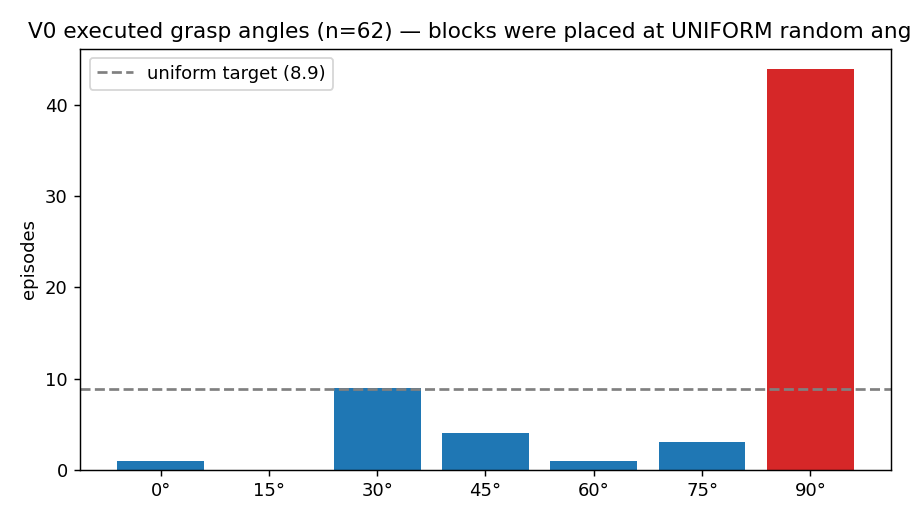
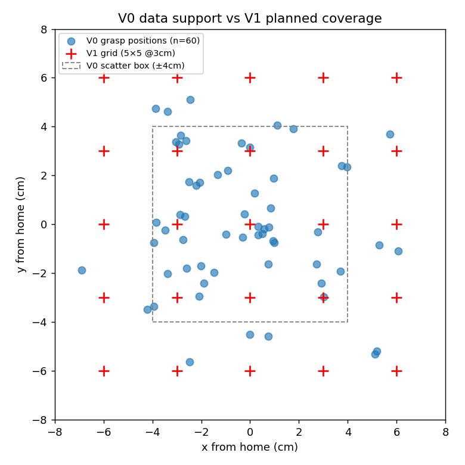
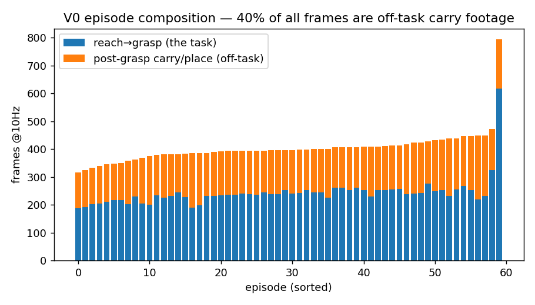
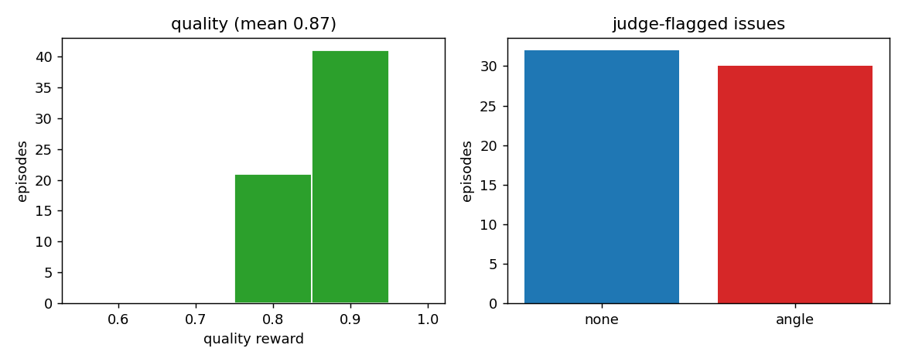

# V0 Post-Mortem — What 60 Episodes Taught Us (Workshop Data & Figures)

*Dataset: `lerobot_v0`, 60 episodes / 19.3k frames, collected 2026-07-06 by the scripted
autograsp pipeline (self-resetting loop, random ±4cm scatter box, random 0–90° angles).
Policy: ACT 51.6M, 100k steps on NCSA DeltaAI (62 min, 1 GPU-hour), deployed 2026-07-07.
The point of this document: V0 worked — and its failures were **measurable, diagnosable,
and each one became a V1 design decision.***

---

## 1. What V0 achieved

- **End-to-end loop closed in 2 days**: hands-free collection → cluster training → real-arm
  deployment, all on standard tooling (LeRobot / ACT / Slurm)
- 60/60 collected episodes passed the quality gate (mean reward **0.87**); collection ran at
  ~30 episodes/hour unattended
- Deployed policy achieved **autonomous picks**: visual reach (including off-center blocks),
  self-rotation of the wrist, descent, grasp, lift
- Offline replay: the policy reproduces training trajectories to **1.9mm** mean position
  error — establishing that failures below are **data** problems, not model problems

## 2. Failure 1 — angle supervision collapsed (the big one)

Blocks were *placed* at uniform random angles — but the pipeline *grasped* at ~90°
regardless: **44 of 62 episodes (71%)**. A cube closes mechanically at any wrist angle, and
the quality judge passed these with `issue=angle` at reward 0.8 (30/62 episodes flagged —
fig 3). The policy therefore learned *"rotate to ~90°, occasionally something else."*

**Consequence on the robot:** faced with a 45° block, the policy **froze** — imitation
learning averages conflicting modes into inaction (the classic multimodality failure,
cf. Belkhale et al. NeurIPS'23). It never rotated, hovered 8mm above grasp height, and
never closed.

**→ V1 decision:** grasp angle is snapped to the block's measured flat-face orientation
(`minAreaRect`, cloud + mask cross-check) — a deterministic *angle contract* — and the gate
rejects any episode whose measured deviation exceeds 10°. The judge (unreliable off-axis:
it once scored a visually perfect 30° grasp as "20° off") lost its veto on angle.

## 3. Failure 2 — competence stops at the edge of the data

Deployment showed textbook **interpolation-only generalization**: reliable picks inside the
scatter zone (including visually-tracked off-center blocks); at ~6cm+ the reach still
tracked the block but the *descent regressed toward the training mean* — grasping air.
Position support in the data is dense centrally and sparse at the rim (figure above).

**→ V1 decision:** systematic **5×5 grid @3cm × 7 angles (+ jitter, + edge repeats)** —
coverage becomes a design input, not a sampling accident. Evaluation runs on the *same*
grid, producing a per-cell success heat-map.

## 4. Failure 3 — the action space hid a critical event

The grip channel was **binary** (0=open / 1=close). But every demo's finger *pre-position*
(fingers narrowed to `object width + 5mm` before the close) was done by the collection
script — invisible in the actions. At deployment the policy hovered at grasp height
**waiting for a finger state it could not command**; a hand-written shim had to reproduce
the pre-position before the policy's own close would fire (which it then did with
demo-consistent timing, ~0.9s after the snap).

**→ V1 decision:** gripper **aperture in mm is the action channel** (104 open → width+8
pre-position → 20 close). Everything the policy must reproduce is now expressible.

## 5. Failure 4 — 40% of every episode was off-task

Episodes recorded reach→grasp→lift→**carry→place** — but the task is "pick up." The carry
tail (40% of all frames) both wasted capacity and created a *phase ambiguity*: after the
grasp, "hold" and "lift" both exist in the data at similar states, and the deployed policy
visibly **dithered** (bobbing z) between them.

**→ V1 decision:** episodes end at grasp + 5cm verified lift. The carry/place leg still
happens — repurposed as the (unrecorded) reset that positions the block for the next grid
cell, halving episode length and doubling collection throughput.

## 6. Failure 5 — self-calibrating loops drifted during collection

Three "self-improving" calibration loops (gripper offset, angle bias, both fed by
judge/depth measurements) **drifted three separate times** across the project, twice
corrupting the calibration file mid-session (e.g. finger offset -15.2mm → -4.9mm =
off-center grasps; angle bias pegged at its +25° clamp). Noisy-signal-driven self-tuning
and data collection do not mix.

**→ V1 decision:** all calibration constants **frozen** during collection (writes disabled;
measurements still print as diagnostics). Consistency is a contract, not an aspiration.

## 7. Scorecard: V0 → V1

| Finding (measured) | V1 change |
|---|---|
| 71% of grasps at 90° despite uniform block angles | angle contract: flat-face snap + geometric gate |
| judge angle opinion unreliable off-axis | judge demoted to centering/stability; geometry decides angle |
| competence bounded by ±4–5cm data support | 5×5 grid ×7 angles + jitter + edge reps (≈225 eps) |
| pre-position invisible in binary grip action | continuous aperture-mm action channel |
| 40% off-task frames + post-grasp dithering | episode ends at lift; place = unrecorded reset |
| zero recovery behavior in data | ~30 scripted perturb-then-correct episodes |
| calibration drift ×3 | constants frozen during collection |

*Full literature grounding for each decision: [V1_data_research.md](V1_data_research.md).
Methodology these decisions crystallized into: [DATA_STANDARD.md](DATA_STANDARD.md).*
