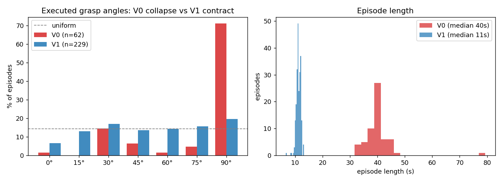

# V0 vs V1 — Dataset Comparison (living document)

*Collection metrics measured from disk 2026-07-08. Deployment success rates get filled in
after each policy's grid evaluation. Companion docs: [V0_ANALYSIS.md](V0_ANALYSIS.md)
(post-mortem), [DATA_STANDARD.md](DATA_STANDARD.md) (method).*

## Collection

| Metric | **V0** (random scatter) | **V1** (systematic grid) | Change |
|---|---|---|---|
| Episodes (dataset) | 60 | **229** | 3.8× |
| Collection strategy | random ±4cm, random angle | 5×5 grid @3cm × 7 angles + jitter + edge reps + recovery | designed support |
| Expert save rate | 100% (62 att) | **99.1%** (231 att) | held at scale ✓ |
| Mean quality reward | 0.90 | 0.90 | consistent |
| **Throughput (episodes/hr)** | 31.6 | **66.7** | **2.1×** (1 pickup/episode + end-at-lift) |
| Median episode length | 39.6 s | **11.2 s** | 3.5× denser task signal |
| Total frames | 24.2k | 25.7k | ~same storage, 3.8× the episodes |
| Off-task (carry) frames | ~40% | **~0%** (episode ends at lift) | eliminated |
| **Largest angle-bin share** | **71% (@90°)** | **19.7%** (~uniform; 0°/90° alias on a square) | supervision de-collapsed |
| Grid coverage holes | n/a (uncontrolled) | **0 / 25 cells** | complete support |
| Recovery episodes | 0 | ~30 (scripted perturb→correct) | new axis |
| Action space | binary grip (pre-position hidden) | aperture in mm (104 → width+8 → 20) | fully expressible |
| Calibration during collection | self-tuning (drifted 3×) | **frozen constants** | consistency contract |
| Angle authority | Gemini arbiter (unreliable off-axis) | minAreaRect flat-face snap + geometric gate | deterministic |

## Training

| | **V0** | **V1** |
|---|---|---|
| Policy | ACT 51.6M | ACT 51.6M (same recipe) |
| Steps / wall-time | 100k / 62 min (GH200) | 150k / ~1.5 h *(submitted 2026-07-08)* |
| Final loss | 0.043 | *(fill in)* |
| Offline replay error | 1.9 mm | *(fill in)* |

## Deployment (grid evaluation — measured 2026-07-13, 100 graded grasps)

| | **V0 policy** | **V1 policy** |
|---|---|---|
| **Overall** | n/a (not measured systematically) | **97/100 (97%), mean grade 0.70** |
| **Out-of-distribution (±9cm ring)** | — | **13% (2/15) — hard extrapolation cliff** |
| In-zone straight block (0°) | reliable picks (incl. off-center visual tracking) | 88% — all 3 run failures here (0/90 aliasing, grade 0.58) |
| Rotated block (25–70°) | **froze** (mode averaging) | **100% (75/75) — the headline result** |
| Boundary cells (±6cm) | miss (descent regressed to training mean) | **97% at the 6 cm ring** (no spatial falloff) |
| Per-cell heat-map | n/a | [figures/v1_eval_heatmap.png](figures/v1_eval_heatmap.png) · full report: [V1_EVAL_REPORT.md](V1_EVAL_REPORT.md) |

**How to read this document:** every V1 improvement in the collection table is a *designed
response* to a *measured* V0 failure — the mapping is 1:1 with the findings in
[V0_ANALYSIS.md](V0_ANALYSIS.md). The deployment table is deliberately unfilled until the
grid eval runs: collection metrics are leading indicators, but per-cell success is the
ground truth.
