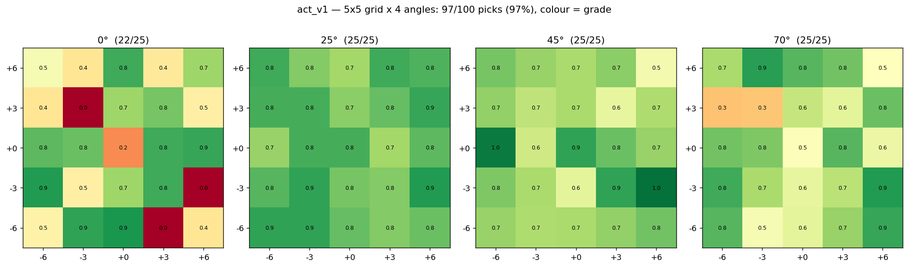
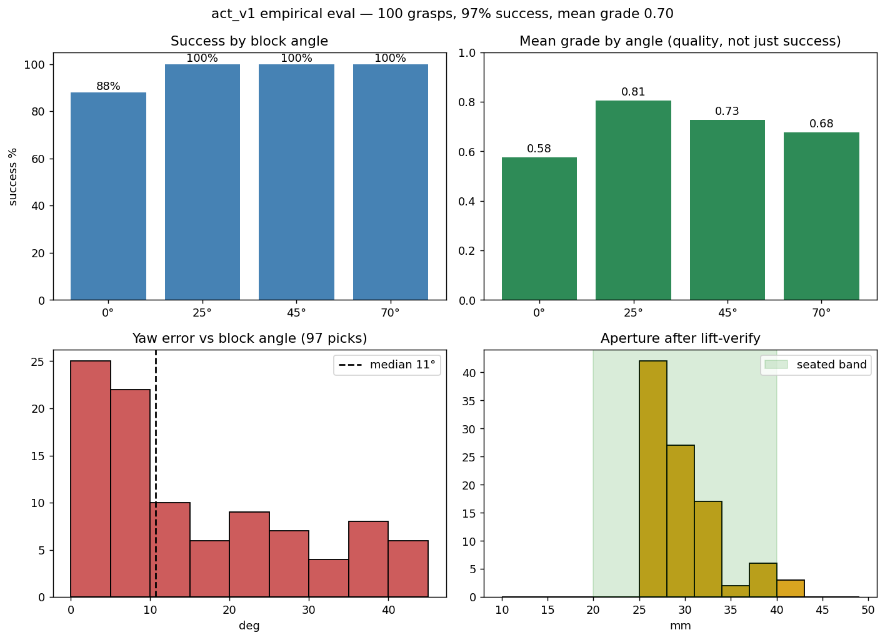

# V1 Policy Evaluation Report — 100 Graded Grasps (2026-07-13)

**Policy:** `models/act_v1` (ACT 51.6M, trained 150k steps on 229 grid-collected episodes)
**Protocol:** 5×5 position grid (3 cm spacing) × 4 block angles {0°, 25°, 45°, 70°} = 100
rollouts, fully unattended (`notebooks/v1_eval.ipynb`). Success requires surviving an 8 cm
lift-verify. Every grasp graded 0–1 (penalties: re-grips, yaw error vs block angle, aperture
outside the seated band). Hardware faults reboot-and-retry and never enter the ledger.
Raw data: `data/v1_eval_100.json`.

## Headline

| Metric | Value |
|---|---|
| **Pick rate** | **97 / 100 (97%)** |
| Mean grade (quality 0–1) | 0.70 |
| Rotated blocks (25/45/70°) | **75/75 (100%)** |
| Straight blocks (0°) | 22/25 (88%) — all 3 failures of the run |
| Spatial falloff | none: 100% @centre · 97% @3 cm ring · 97% @6 cm ring |
| Yaw alignment | median error 11° (p90 38° — the tail is the 0° aliasing) |
| Seated aperture | median 30 mm (seated band 20–40) |
| Edge/corner grasps | 0 |

## Per-angle breakdown

| Angle | Success | Mean grade | Reading |
|---|---|---|---|
| 0° | 22/25 (88%) | **0.58** | the aliasing signature: lowest success AND lowest quality |
| 25° | 25/25 (100%) | 0.81 | cleanest angle |
| 45° | 25/25 (100%) | 0.73 | solid |
| 70° | 25/25 (100%) | 0.68 | solid, slightly noisier alignment |

## The three failures — all one root cause

| Cell | Angle | Fingerprint |
|---|---|---|
| (+3, −6) | 0° | rotated ~41° off, closed on air |
| (+6, −3) | 0° | never committed to a close in 60 s |
| (−3, +3) | 0° | rotated ~41° off, closed on air |

All three at 0°, two with ~41° yaw error — the **0°/90° label aliasing** measured in the
dataset audit (identical square-block scenes carried both 0° and 90° labels → the policy
mode-averages toward ~45° on straight blocks). This is a *data* defect with a queued fix
(V1.1: canonical angle labels + ~35 replacement episodes + retrain), not an architecture or
coverage problem. The 88%-vs-100% split IS the aliasing hypothesis confirmed on hardware.

## Secondary findings

1. **Grid coverage worked.** V0 missed everything beyond its ±4 cm scatter; V1 shows no
   spatial falloff out to the 6 cm ring (97%). Designed support → interpolation everywhere
   on the grid.
2. **The grip-authority tax.** 94/97 successful picks needed at least one stall re-grip
   (AX-12 + the 2N clear_error race). The retry chain converts what would be failures into
   ~0.1-grade penalties — mean grade 0.70 rather than ~0.9. This is the largest *quality*
   (not success) limiter, and it is mechanical, not learned.
3. **Direct placement worked.** 57/100 combos were staged by the policy's own previous pick
   (clean picks carried straight to the next cell), roughly halving stagehand time with no
   measured effect on the following combo's outcome.
4. **Grading separates success from quality.** 0° *succeeds* 88% of the time but at 0.58
   quality — success-rate alone would hide the aliasing that the grade exposes.

## V0 → V1, deployment (fills the comparison table)

| | V0 policy | V1 policy (measured) |
|---|---|---|
| In-zone straight block | reliable | 88% (aliasing-limited) |
| Rotated block | **froze** (mode averaging) | **100% (75/75)** |
| Boundary cells | missed (regressed to training mean) | 97% at the 6 cm ring |
| Per-cell measurement | none | 100-grasp graded heat-map |

## What this run bought (beyond the numbers)

The eval itself was hardened into an instrument over three sessions: policy-lift freeze
(policies that learn to lift shook blocks loose pre-grading), edge-grasp partial credit,
hardware circuit breaker (a dying gripper once wrote 36 fake "policy failures" in an hour —
now reboots and retries, ledger stays clean), fail→total-reset ladder, and direct next-spot
placement. The same instrument re-runs unchanged for V1.1 and V2 — before/after heat-maps
on identical protocol.

## Next

1. **V1.1 aliasing patch**: canonicalize square-object angle labels, ~35 replacement
   straight-block episodes, retrain, re-run THIS eval → expect 0° to join the 100% club
   and the yaw-error tail to collapse.
2. Grip authority: raise close force / rework the async chain to cut the 94% re-grip rate
   (targets mean grade, not success rate).
3. V2 (multi-object) on the same protocol.
