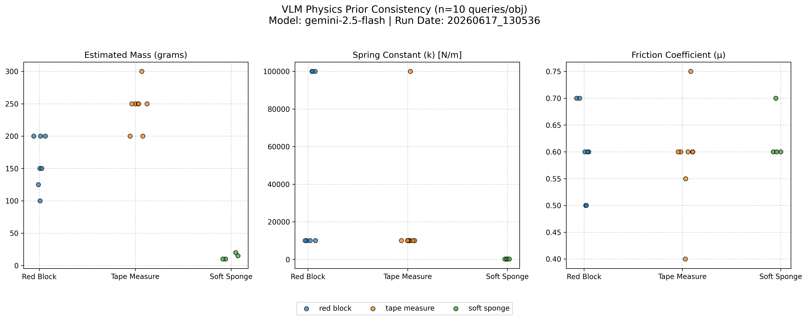

# Measurement Update (June 17, 2026)

## 1. Sensor Poll Rates
Full hardware stack running. F/T sensor successfully initialized at 250 Hz target.

| Sensor | Topic | Expected (Hz) | Measured (Hz) |
|---|---|---|---|
| Gripper Motor | `/gripper/state` | 5.0 | 10.00* |
| Force Torque Sensor | `/ft_sensor/wrench` | 250.0 | 249.80 |
| Arm Position | `/arm/tcp_pose` | 500.0 | 499.97 |
| Camera | `/camera/gripper_camera/camera/color/image_raw` | 10.0 | 10.01 |
*\*Gripper bus total is 10 Hz (5 Hz per motor).*

## 2. Text-Based VLM Consistency
10 queries/object using text-only prompts to test baseline physics priors.

* **Red Block:** ~100g - 250g | ~10k - 100k N/m
* **Tape Measure:** ~200g - 300g | ~10k - 100k N/m
* **Soft Sponge:** ~10g - 20g | ~200 N/m

## 3. Dynamic Live-Vision VLM Testing
Live RGB frames (`/camera/gripper_camera/camera/color/image_raw`) passed to Gemini 2.5 Flash.

**Object 1: Measuring Tape**
* **Detected:** Stanley measuring tape
* **Mass:** 450.0 g
* **Stiffness:** 500,000 N/m
* **Friction:** 0.5

**Object 2: Water Bottle**
* **Detected:** Cylindrical water bottle body
* **Mass:** 515.0 g
* **Stiffness:** 1,000 N/m
* **Friction:** 0.6

**Object 3: Orange Component**
* **Detected:** Current sensor/shunt module
* **Mass:** 40.0 g
* **Stiffness:** 100,000 N/m
* **Friction:** 0.6
